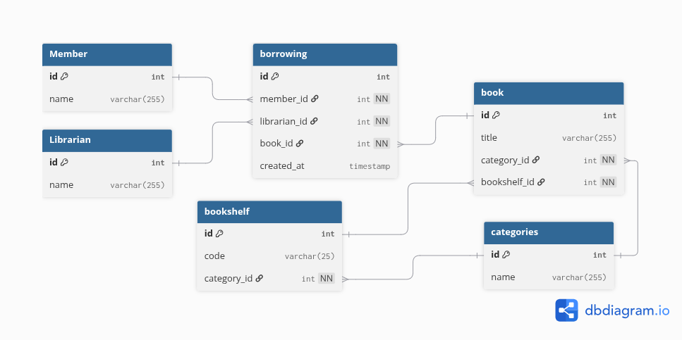
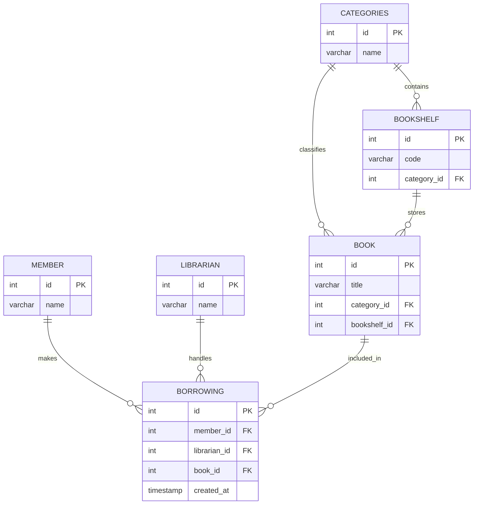
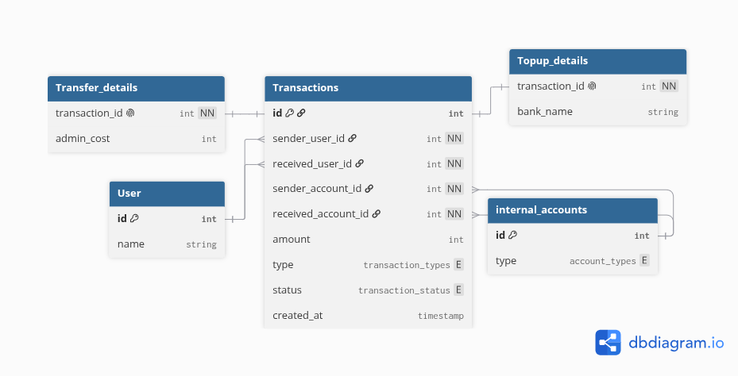
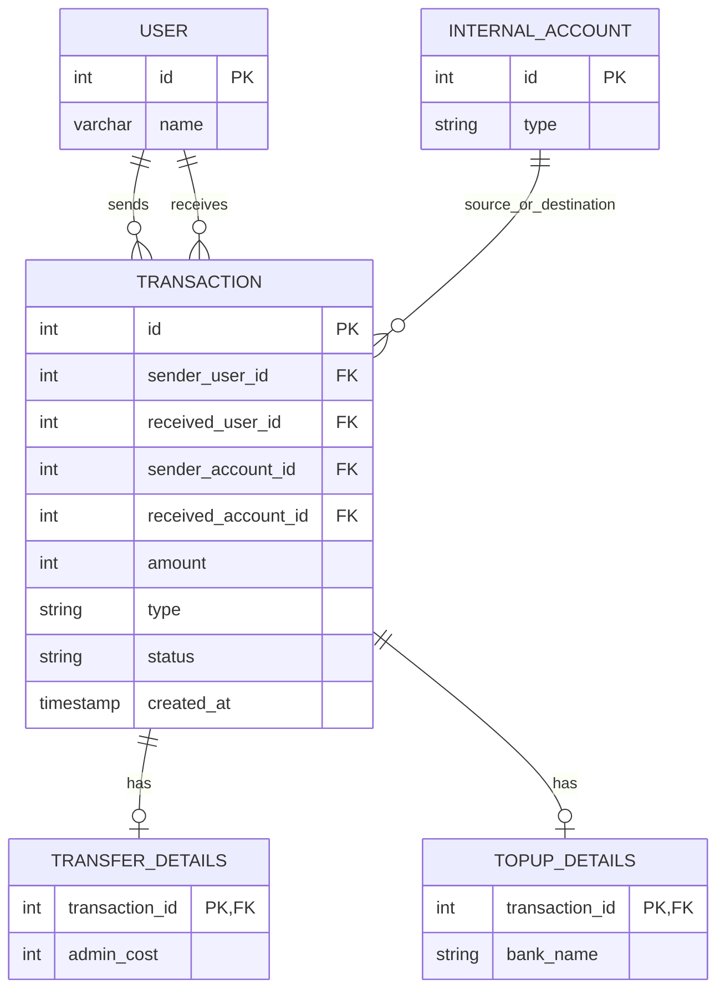

# Database Schemas

Dokumentasi skema database untuk sistem perpustakaan dan ecommerce.

## Sistem Perpustakaan

Source Mermaid: [db-Library.md](db-Library.md)



### DB Diagram

```dbml
Table MEMBER {
    id int [pk]
    name varchar(255)
}

Table LIBRARIAN {
    id int [pk]
    name varchar(255)
}

Table CATEGORIES {
    id int [pk]
    name varchar(255)
}

Table BOOKSHELF {
    id int [pk]
    code varchar(50)
    category_id int [not null, ref: > CATEGORIES.id]
}

Table BOOK {
    id int [pk]
    title varchar(255)
    category_id int [not null, ref: > CATEGORIES.id]
    bookshelf_id int [not null, ref: > BOOKSHELF.id]
}

Table BORROWING {
    id int [pk]
    member_id int [not null, ref: > MEMBER.id]
    librarian_id int [not null, ref: > LIBRARIAN.id]
    book_id int [ref: > BOOK.id]
    created_at timestamp [not null]
}
```

### Mermaid



SQL schema: [sistem_perputaskaan.sql](sistem_perputaskaan.sql)

## Ecommerce

Source Mermaid: [db-Ecommerce.md](db-Ecommerce.md)



### DB Diagram

```dbml
Enum transaction_types {
    top_up
    transfer
}

Enum account_types {
    bca
    bri
    dana
}

Enum transaction_status {
    pending
    success
    failed
}

Table USER {
    id int [pk]
    name varchar(255)
}

Table TRANSACTION {
    id int [pk]
    sender_user_id int [not null, ref: > USER.id]
    received_user_id int [not null, ref: > USER.id]
    sender_account_id int [not null, ref: > INTERNAL_ACCOUNT.id]
    received_account_id int [not null, ref: > INTERNAL_ACCOUNT.id]
    amount int
    type transaction_types
    status transaction_status
    created_at timestamp
}

Table INTERNAL_ACCOUNT {
    id int [pk]
    type account_types
}

Table TRANSFER_DETAILS {
    transaction_id int [not null, unique, ref: - TRANSACTION.id]
    admin_cost int
}

Table TOPUP_DETAILS {
    transaction_id int [not null, unique, ref: - TRANSACTION.id]
    bank_name varchar(255)
}
```

### Mermaid


