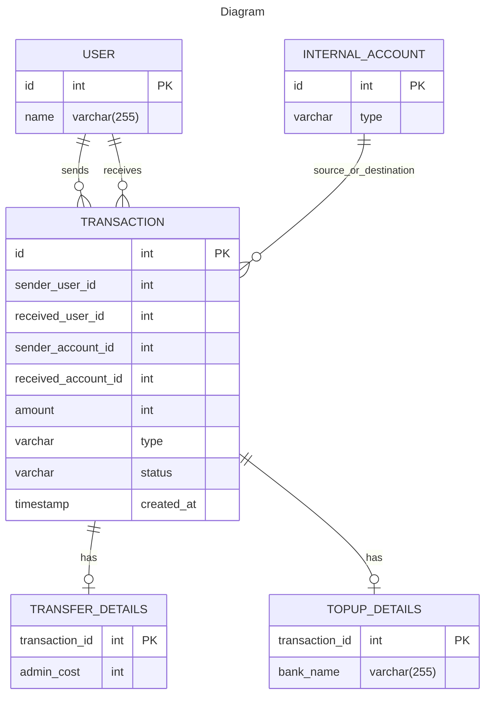

```mermaid
---
title: Diagram
---
erDiagram
    USER {
        id int PK
        name varchar(255)
    }

    TRANSACTION {
        id int  PK
        sender_user_id int
        received_user_id int
        sender_account_id int
        received_account_id int
        amount int
        varchar type
        varchar status
        timestamp created_at
    }

    INTERNAL_ACCOUNT {
        id int  PK
        varchar type
    }

    TRANSFER_DETAILS {
        transaction_id int  PK
        admin_cost int
    }

    TOPUP_DETAILS {
        transaction_id int  PK
        bank_name varchar(255)
    }

    USER ||--o{ TRANSACTION : sends
    USER ||--o{ TRANSACTION : receives
    INTERNAL_ACCOUNT ||--o{ TRANSACTION : source_or_destination
    TRANSACTION ||--o| TRANSFER_DETAILS : has
    TRANSACTION ||--o| TOPUP_DETAILS : has
```
