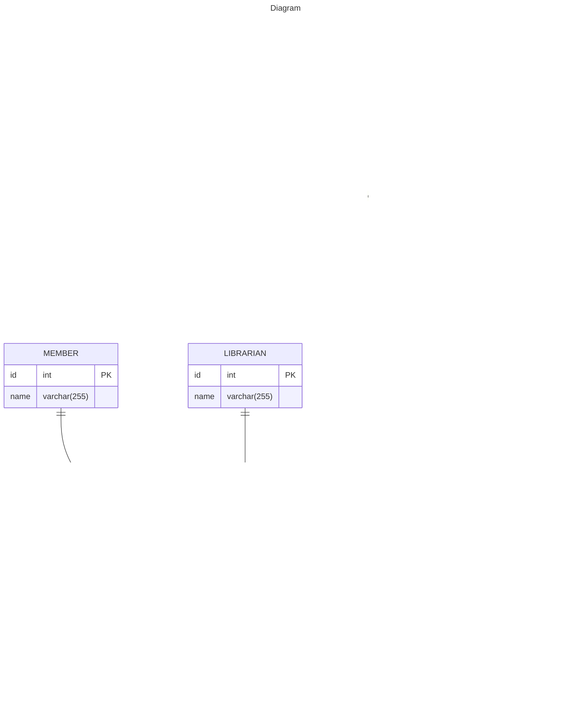

```mermaid
---
title: Diagram
---
erDiagram
   MEMBER {
        id int PK
        name varchar(255)
    }

    LIBRARIAN {
        id int PK
        name varchar(255)
    }

    CATEGORIES {
        id int PK
        name varchar(255)
    }

    BOOKSHELF {
        id int PK
        code varchar(50)
        category_id  int not null
    }

    BOOK {
        id int PK
        title varchar(255)
        category_id  int not null
        bookshelf_id  int not null
    }

    BORROWING {
        id  int PK
        member_id int not null
        librarian_id int not null
        book_id int
        timestamp created_at not null
    }

    CATEGORIES ||--o{ BOOKSHELF : contains
    CATEGORIES ||--o{ BOOK : classifies
    BOOKSHELF ||--o{ BOOK : stores
    MEMBER ||--o{ BORROWING : makes
    LIBRARIAN ||--o{ BORROWING : handles
    BOOK ||--o{ BORROWING : included_in
```
